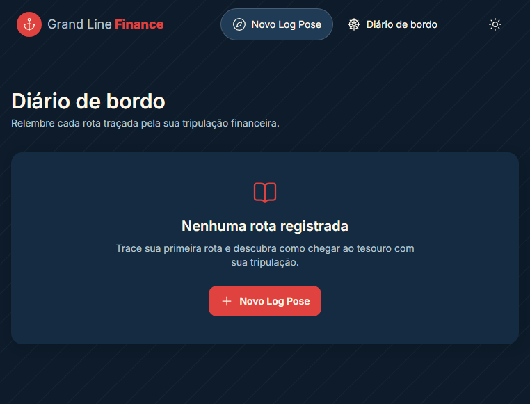
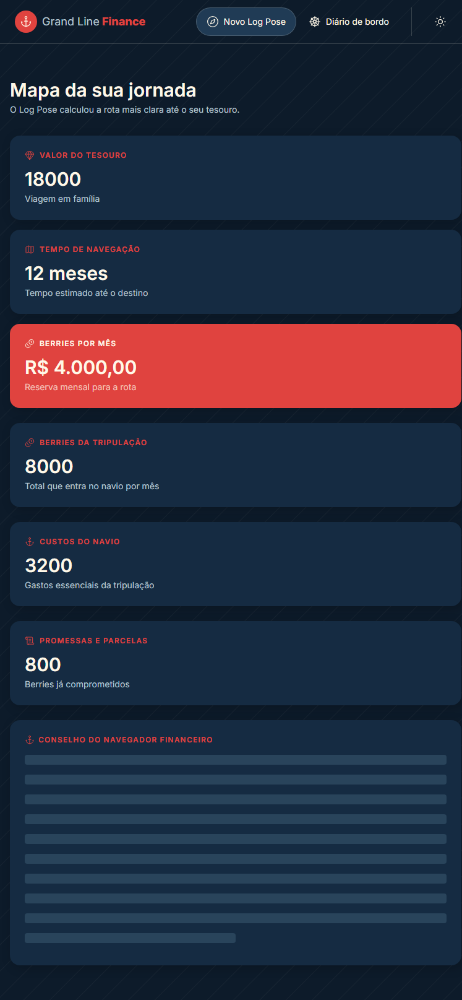

# Grand Line Finance

Aplicacao web para planejamento financeiro pessoal. O Grand Line Finance transforma uma meta em uma rota de economia: a pessoa informa sua renda, despesas, dividas, objetivo e prazo para visualizar quanto precisa reservar por mes.

## Indice

- [Status](#status)
- [Funcionalidades](#funcionalidades)
- [Demonstracao Visual](#demonstracao-visual)
- [Acesso ao Projeto](#acesso-ao-projeto)
- [Tecnologias Utilizadas](#tecnologias-utilizadas)
- [Como Executar](#como-executar)
- [Scripts Disponiveis](#scripts-disponiveis)

## Status

Concluido para demonstracao e testes locais. A aplicacao ja possui fluxo de simulacao, armazenamento no navegador, historico e resultados com insights financeiros por IA.

## Funcionalidades

- Formulario guiado em seis etapas para registrar uma simulacao.
- Calculo da reserva mensal necessaria para atingir o objetivo.
- Tela de resultados com resumo da meta, prazo, renda, custos e parcelas.
- Insights e perguntas ao navegador financeiro por meio da API Gemini.
- Historico de simulacoes salvo no `localStorage`, com consulta e exclusao.
- Navegacao entre nova simulacao, resultado e diario de bordo.
- Alternancia entre tema claro e escuro.
- Layout responsivo para desktop e dispositivos moveis.

## Demonstracao Visual

### Tela inicial


### Historico de simulacoes



### Resultado de uma simulacao



## Acesso ao Projeto

- **Repositorio:** [github.com/Dyonatas-Menegatti/OnePiece](https://github.com/Dyonatas-Menegatti/OnePiece)
- **Download:** [baixar o projeto pelo GitHub](https://github.com/Dyonatas-Menegatti/OnePiece/archive/refs/heads/main.zip)

Para baixar via Git:

```bash
git clone https://github.com/Dyonatas-Menegatti/OnePiece.git
cd OnePiece
```

## Tecnologias Utilizadas

| Tecnologia ou biblioteca | Versao declarada |
| ------------------------ | ---------------- |
| React                    | `^19.2.8`        |
| React DOM                | `^19.2.8`        |
| TypeScript               | `~6.0.2`         |
| Vite                     | `^8.2.0`         |
| Tailwind CSS             | `^4.3.3`         |
| React Router DOM         | `^7.18.2`        |
| Lucide React             | `^1.31.0`        |
| React Loading Skeleton   | `^3.5.0`         |
| ESLint                   | `^9.7.0`         |
| Prettier                 | `^3.0.0`         |

As demais versoes de desenvolvimento estao disponiveis no arquivo [package.json](package.json).

## Como Executar

### Pre-requisitos

- Node.js 20 ou superior.
- npm 10 ou superior.

### Instalacao

Depois de clonar ou baixar o projeto, instale as dependencias na raiz:

```bash
npm install
```

### Variavel opcional da API Gemini

Para habilitar os insights e o chat financeiro, crie um arquivo `.env.local` na raiz do projeto:

```env
VITE_GEMINI_API_KEY=sua_chave_da_api_gemini
```

Sem essa chave, as telas de simulacao, calculo, historico e resultado continuam disponiveis, mas os recursos de IA nao funcionarao.

### Rodar em desenvolvimento

```bash
npm run dev
```

Abra no navegador o endereco exibido pelo Vite, normalmente `http://localhost:5173`.

## Scripts Disponiveis

| Comando            | Finalidade                                                       |
| ------------------ | ---------------------------------------------------------------- |
| `npm run dev`      | Inicia o servidor de desenvolvimento com atualizacao automatica. |
| `npm run build`    | Executa a verificacao TypeScript e gera a versao de producao.    |
| `npm run preview`  | Serve localmente o build de producao.                            |
| `npm run lint`     | Verifica problemas de lint no projeto.                           |
| `npm run lint:fix` | Corrige automaticamente problemas de lint aplicaveis.            |
| `npm run format`   | Formata os arquivos com Prettier.                                |
